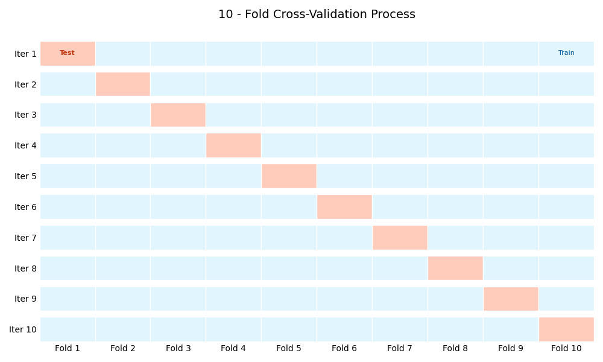

# K-Nearest Neighbor (KNN) Classifier with Statistical Validation

Implemented a complete K-Nearest Neighbor (KNN) classifier from scratch in Python, with the goal of identifying optimal hyperparameters (K-value, distance metric) through a statistically rigorous validation process. The focus was on algorithmic understanding, performance reproducibility, and robust evaluation design.


---

## 🎯 Core Objective

To demonstrate a from-first-principles understanding of the KNN algorithm and, more importantly, to design and execute a statistically sound experimental pipeline for hyperparameter tuning and model evaluation.

---

## 🤖 Algorithm & Pipeline

This project is built in two key parts: the core algorithm and the validation "harness" that runs it.

### 1. From-Scratch KNN Classifier (`Knn.py`)

* **`Knn.py`:** A class-based implementation of the K-Nearest Neighbor algorithm. It takes a training dataset and, for a new instance, calculates the distance to all training points, finds the "K" nearest ones, and predicts the class via majority vote.
* **`Distance.py`:** A custom library built to support the KNN classifier, containing from-scratch implementations of multiple distance functions:
    * **Minkowski Distance** (and its special case, Euclidean)
    * **Cosine Similarity**
    * **Mahalanobis Distance**

### 2. Rigorous Validation Pipeline (`Knnexperiment.py`)

This is the core of the project. To find the best model, a robust **5x10 Stratified Cross-Validation** process was designed.

1.  **Shuffle (x5):** The entire dataset is shuffled 5 separate times to create 5 different "versions" of the data. This prevents a single "lucky" data split from biasing the results.
2.  **Split (10-Folds):** Each of the 5 shuffled datasets is then put through a **10-fold stratified cross-validation**.
    * The data is split into 10 equal-sized "folds," ensuring that the class distribution in each fold matches the original dataset (stratification).
    * The model is trained 10 times—each time using 9 folds for training and 1 fold for validation.
3.  **Grid Search:** This 5x10 validation process is run for every hyperparameter combination in a grid search to find the optimal settings.
4.  **Evaluate:** The final performance for each combination is the **mean accuracy** across all 50 runs (5 shuffles x 10 folds). A **95% Confidence Interval (CI)** is then calculated to show the statistical range of the expected performance.



---

## 📊 Results & Hyperparameter Tuning

A grid search was performed over 5 different model configurations. The 5x10 cross-validation produced the following statistically stable results:

| K-Value (Neighbors) | Distance Metric | Mean Accuracy | 95% Confidence Interval |
| :---: | :---: | :---: | :---: |
| 5 | Minkowski | 95.91% | [95.63, 96.19] |
| **10** | **Minkowski** | **96.00%** | **[95.74, 96.26]** |
| 30 | Minkowski | 95.11% | [94.75, 95.46] |
| 5 | Cosine | 95.69% | [95.35, 96.02] |
| 10 | Cosine | 95.83% | [95.54, 96.12] |

*(More details of data is in `report.pdf`)*

### Conclusion

The optimal configuration was determined to be **K = 10** with the **Minkowski distance metric**. This setup achieved the highest mean accuracy of **96.00%**, with a 95% confidence interval of [95.74%, 96.26%].

This project demonstrates a strong command of supervised learning theory, custom algorithm implementation, and—most critically—the statistical methodologies required to validate and report machine learning performance reliably.

---

## 🚀 How to Run

1.  Clone the repository.
2.  Ensure you have `numpy` and `scikit-learn` installed (`sklearn` is used only for its `StratifiedKFold` and `shuffle` utilities, not for the classifier itself).
    ```bash
    pip install numpy scikit-learn
    ```
3.  Run the main experiment file from your terminal:
    ```bash
    python Knnexperiment.py
    ```
4.  The script will run the full 5x10 cross-validation for all 5 hyperparameter configurations and print the final mean accuracy, standard deviation, and confidence interval for each.